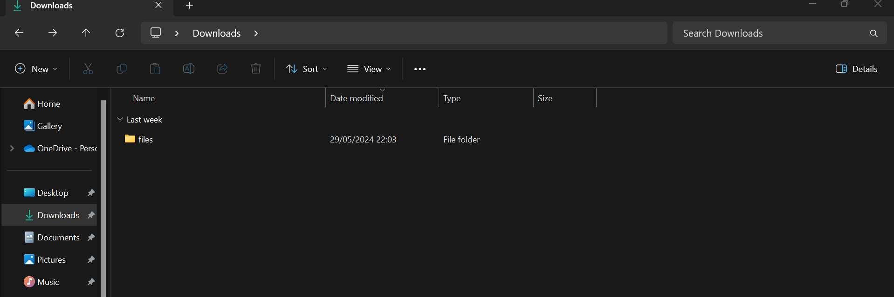
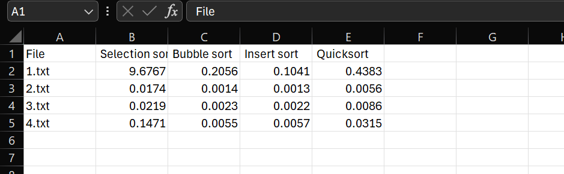

# BenchmarkAlgo

The objective is to implement the different algorithms (selection sort, bubble sort, insertion sort, Quicksort) then to have them tested by sorting the words in the files in lexicographic order. To validate that the sorting is correct, the file name is the hash (MD5) of the correctly sorted file.

*Start projet*

**Place the folder *files* in the download folder in order to use the files necessary for the algorithm (You can choose the text files you want to time. Do not put text files that are too large)**



```
dotnet build
```

```
cd ./bin/Debug/net8.0
```

```
./Benchmark.exe
```

*The results file CSV is in the \bin\Debug\net8.0*

**Results exemple**

