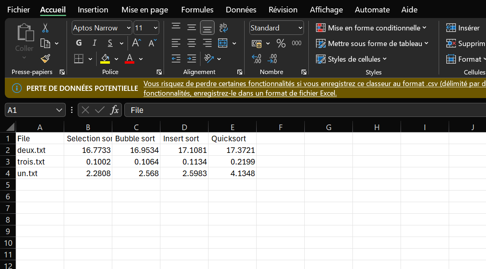

# BenchmarkAlgo (School projet)

The objective is to implement the different algorithms (selection sort, bubble sort, insertion sort, Quicksort) then to have them tested by sorting the words in the files in lexicographic order. To validate that the sorting is correct, the file name is the hash (MD5) of the correctly sorted file.

*Start projet*

```
dotnet build
```

```
cd ./bin/Debug/net8.0
```

```
./Benchmark.exe
```

**Place the files folder in the download folder in order to use the files necessary for the algorithm**


**Results exemple**
